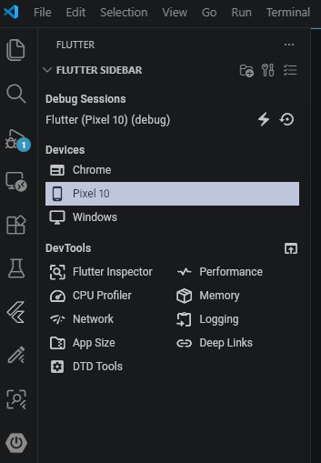

# Flutter

## Installation

Telecharger et installer Flutter et android studio.
Telecharger a l'aide d'andoid studio le SDK et Android SDK Command-line Tools
Set variable environnement :

* ANDROID_HOME
* Path: ajout "C:\Users\ruffi\AppData\Local\Android\Sdk\platform-tools"
* Tapez "Activer ou désactiver des fonctionnalités Windows" dans votre barre de recherche.
  * Assurez-vous que les cases suivantes sont cochées :
  * Plateforme de l'hyperviseur Windows
  * Plateforme de machine virtuelle

Vérification installation :

```sh
flutter --version
dart --version
flutter doctor
flutter config --android-sdk "C:\Users\ruffi\AppData\Local\Android\Sdk"
flutter doctor --android-licenses
# Voir les devices de disponibles
flutter devices
```

### Ajout d'un emulateur


## Create application (exemple nom d'application birdle)

```sh
flutter create birdle --empty
```

## Run application

```sh
cd birdle
flutter run -d <YOUR_DEVICES>
# Exemple:
# flutter devices
# Found 3 connected devices:
#   sdk gphone16k x86 64 (mobile) • emulator-5554 • android-x64    • Android 17 (API 37) (emulator)
#   Windows (desktop)             • windows       • windows-x64    • Microsoft Windows [version 10.0.26200.8457]
#   Chrome (web)                  • chrome        • web-javascript • Google Chrome 148.0.7778.96
flutter run -d emulator-5554
```

## Utiliser le rechargement à chaud

Modifier le code :

```dart
child: Text('Hello World!'),
```

Cliquer dans le terminal ou l'application est en cours d'execution (flutter run -d emulator-5554), Puis appuyer sur la touche  `r`.

## Création et ajout de widgets

Ajout widget birdle\lib\game.dart puis incorporer dans le main.dart.

main.dart

```sh
import 'package:flutter/material.dart';
import 'game.dart';
...
class Tile extends StatelessWidget {
  const Tile(this.letter, this.hitType, {super.key});

  final String letter;
  final HitType hitType;

  @override
  Widget build(BuildContext context) {
    return Container();
  }
}
...
```

### Utilisation du widget dans l'application

main.dart

```sh
class MainApp extends StatelessWidget {
  const MainApp({super.key});

  @override
  Widget build(BuildContext context) {
    return const MaterialApp(
      home: Scaffold(
        body: Center(
          child: Tile('A', HitType.hit), // NEW
        ),
      ),
    );
  }
}
```

### Le container Widget

```sh
class Tile extends StatelessWidget {
  const Tile(this.letter, this.hitType, {super.key});

  final String letter;
  final HitType hitType;

  @override
  Widget build(BuildContext context) {
    return Container(
      width: 60,
      height: 60,
      decoration: BoxDecoration(
        border: Border.all(color: Colors.grey.shade300),
        color: switch (hitType) {
          HitType.hit => Colors.green,
          HitType.partial => Colors.yellow,
          HitType.miss => Colors.grey,
          _ => Colors.white,
        },
        // TODO: add children
      ),
    );
  }
}
```

## Disposition des widgets

* Quelle est la principale différence entre un widget Colonne et un widget Ligne ?
La colonne dispose les enfants verticalement ; la ligne les dispose horizontalement.
La colonne dispose ses éléments enfants le long de l'axe vertical, tandis que la ligne utilise l'axe horizontal.

* Que fournit le widget Scaffold dans une application Flutter ?
Une mise en page de style Material avec des emplacements pour la barre d'application, le corps, le tiroir, et plus encore.
Scaffold est un widget pratique qui fournit une structure de page Material standard.

## Debug mode

Selectionner en bas à droite de vscode votre device.
Ouvrir la class main de votre app.
Puis cliquer sur Run et debug mode de vscode

Vosu pouvez aussi acceder au debug mode apres avoir fais votre `flutter run -d emulator-5554`.
Dans ce cas vous trouverez dans les logs l'url d'acces (http://127.0.0.1:55851/FGdRUadxBFc=/devtools/?uri=ws://127.0.0.1:55851/FGdRUadxBFc=/ws)

### Flutter widget preview

Annoted vos widget @Preview.

```sh
@Preview(name: 'Tile')
Widget tilePreview() => const Tile('A', HitType.hit);

@Preview(name: 'GamePage')
Widget gamePagePreview() => GamePage();

@Preview(name: 'MainApp')
Widget mainAppPreview() => const MainApp();
```

* Demmarrer en mode de debug
* Activer le mode widget-preview


### Flutter widget inspector


### Flutter properties editor


### Flutter performance


### Flutter memory


### Flutter Network


### Flutter Logging


## User input

Vous avez créé un GuessInputwidget de TextFieldsaisie de texte. Vous l'avez configuré avec une bordure arrondie, une limite de caractères et vous l'avez utilisé `Expanded` pour qu'il remplisse l'espace disponible dans la ligne.

`TextEditingController` permet de lire et de modifier le contenu d'un champ texte. Vous l'avez utilisé pour capturer la saisie de l'utilisateur avec `text` et effacer le champ après la soumission avec `clear()`.

Auparavant, l'autofocus mettait le champ de texte au premier lancement et _FocusNodele_ _requestFocus()_ sont conservait après chaque tentative. Ces détails donnent à votre application une impression de réactivité et de qualité.

Pour répondre aux entrées de l'utilisateur, vous avez spécifié des fonctions de rappel comme `onSubmittedon` et `on` onPressed. Le passage de fonctions de rappel en tant qu'arguments du constructeur permet de conserver des widgets réutilisables et découplés de toute logique spécifique.

## Widget à état

Lorsqu'il est nécessaire de modifier l'apparence ou les données d'un widget au cours de sa durée de vie, un objet compagnon est requis StatefulWidget. Le widget lui-même reste immuable, mais cet Stateobjet compagnon contient des données modifiables et déclenche des reconstructions.

Vous avez restructuré votre GamePagecode pour qu'il conserve un état en créant une classe associée , en y _GamePageState déplaçant la méthode et les propriétés mutables, et en implémentant l'interface appropriée . L'assistance rapide de votre IDE peut automatiser cette conversion. buildcreateState()

Cet appel setStateindique à Flutter de reconstruire l'interface utilisateur d'un widget. Lorsqu'un utilisateur soumet une proposition, vous appelez la fonction setStatepour mettre à jour l'état du jeu, et la grille reflète automatiquement les nouvelles données. Votre application est désormais véritablement interactive !

## Animations simples
